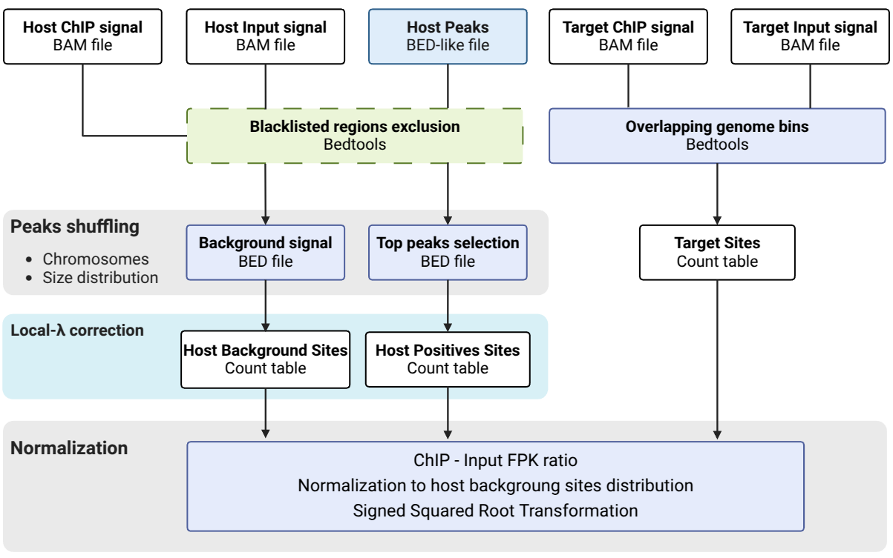

<!-- Improved compatibility of back to top link: See: https://github.com/othneildrew/Best-README-Template/pull/73 -->
<a id="readme-top"></a>
<!--
*** 2025
*** A. Robitaille (alexis.robitaille@leibniz-liv.de)
*** Leibniz Institute of Virology - Hamburg
-->


<!-- PROJECT SHIELDS -->
<!--
*** I'm using markdown "reference style" links for readability.
*** Reference links are enclosed in brackets [ ] instead of parentheses ( ).
*** See the bottom of this document for the declaration of the reference variables
*** for contributors-url, forks-url, etc. This is an optional, concise syntax you may use.
*** https://www.markdownguide.org/basic-syntax/#reference-style-links
-->
[![Contributors][contributors-shield]][contributors-url]
[![Forks][forks-shield]][forks-url]
[![Stargazers][stars-shield]][stars-url]
[![Issues][issues-shield]][issues-url]
[![GPLv3 License][license-shield]][license-url]


<!-- PROJECT LOGO -->
<div align="center">
<h1 align="center">ViPeaQ</h1>

  <p align="center">
    <h3 align="center">This tool is designed to evaluate ChIP signal over a viral genome by comparison with the host ChIP signal.</h3>
    <br />
    <a href="https://github.com/VirusGenomics/ViPeaQ"><strong>Explore the docs »</strong></a>
    <br />
    
    <br />
    <a href="https://github.com/VirusGenomics/ViPeaQ/issues/new?labels=bug&template=bug-report---.md">Report Bug</a>
    ·
    <a href="https://github.com/VirusGenomics/ViPeaQ/issues/new?labels=enhancement&template=feature-request---.md">Request Feature</a>
  </p>

  <a href="https://github.com/VirusGenomics/ViPeaQ">
  
  </a>

</div>


<!-- TABLE OF CONTENTS -->
<details>
  <summary>Table of Contents</summary>
  <ol>
    <li>
      <a href="#about-the-project">About The Project</a>
      <ul>
        <li><a href="#built-with">Built With</a></li>
      </ul>
    </li>
    <li>
      <a href="#getting-started">Getting Started</a>
      <ul>
        <li><a href="#prerequisites">Prerequisites</a></li>
        <li><a href="#installation">Installation</a></li>
      </ul>
    </li>
    <li><a href="#usage">Usage</a></li>
    <li><a href="#parameters">Parameters</a></li>
    <li><a href="#contributing">Contributing</a></li>
    <li><a href="#license">License</a></li>
    <li><a href="#contact">Contact</a></li>
    <li><a href="#acknowledgments">Acknowledgments</a></li>
  </ol>
</details>


<!-- ABOUT THE PROJECT -->
## About The Project

<p align="justify">
Chromatin immunoprecipitation (ChIP) coupled with high-throughput sequencing (ChIP-Seq) is widely used to quantify chromatin states, such as DNA or histone modifications, across many different genomes. Analysis of the differential occupancy between a protein-DNA complex immunoprecipitated with an antibody specific for the protein of interest and an input sample is the basis of ChIP peak calling. Over the years, several bioinformatics tools have been developed. MACS2 and SICER are among the most widely used and rely on statistical models to capture local biases in the genome for sharp or diffuse profiles, respectively. The epigenetic regulation of cellular chromatin and nuclear replicating DNA viruses share similar underlying mechanisms, but a key difference lies in their chromatin dynamics. While cellular chromatin in differentiating or terminally differentiated cells is generally characterized by discrete epigenetic states, viral chromatin patterns are frequently much more complex. 
The complexity of viral ChIP-seq patterns can result from highly variable genome copy numbers and different replication stages of individual viral genomes. As a consequence, proper quantification of viral epigenetic profiles is a very challenging task. Therefore, we aimed to develop  a bioinformatic method that allows distinguishing between background noise or technical artifacts versus biologically relevant enrichment of epigenetic modifications on viral genomes.
We developed a statistical model for viral peak quantification (ViPeaQ), which calculates a level of non-specific chromatin-associated variation on the host genome after input correction and uses it as a normalization factor for host positive signal (peaks) and viral genome enrichment quantification. Furthermore, the pipeline provides graphical output that allows for easy interpretation by non-bionformatics trained researchers.
</p>

<p align="right">(<a href="#readme-top">back to top</a>)</p>


### Built With

* [![GNU][GNU Bash]][GNU-url]
* [![R][R Project]][R-url]
* [![Perl][Perl]][Perl-url]


<p align="right">(<a href="#readme-top">back to top</a>)</p>


<!-- GETTING STARTED -->
## Getting Started

### Shell/Bash Tools

**GNU Core Utilities**
- Basic shell utilities like `awk`, `sed`, `sort`, `mkdir`, and `cut` are required.
- `getopt`
- `wget`
- `gzip`/`gunzip`
- `bc`
- `column`

### Prerequisites

- [bedtools (v2.30.0 or higher recommended)](https://bedtools.readthedocs.io/en/latest/)
- [featureCounts](https://subread.sourceforge.net/featureCounts.html)
- [sambamba](https://lomereiter.github.io/sambamba/)
- [Samtools](https://www.htslib.org/)

### Perl Modules

- [strict](https://perldoc.perl.org/strict)
- [warnings](https://perldoc.perl.org/warnings)
- [Getopt::Std](https://perldoc.perl.org/Getopt::Std)
- [File::Basename](https://perldoc.perl.org/File::Basename)
- [Scalar::Util](https://perldoc.perl.org/Scalar::Util)
- [Statistics::Basic](https://metacpan.org/pod/Statistics::Basic)
- [List::Util](https://perldoc.perl.org/List::Util)

### R Packages

- [dplyr](https://cran.r-project.org/web/packages/dplyr/index.html)
- [ggplot2](https://cran.r-project.org/web/packages/ggplot2/index.html)
- [gridExtra](https://cran.r-project.org/web/packages/gridExtra/index.html)
- [ggtext](https://cran.r-project.org/web/packages/ggtext/index.html)
- [tidyr[1]](https://cran.r-project.org/web/packages/tidyr/index.html)

### Installation

```sh
git clone https://github.com/VirusGenomics/ViPeaQ.git
```

<p align="right">(<a href="#readme-top">back to top</a>)</p>


<!-- USAGE EXAMPLES -->
## Usage
```
ViPeaQ.sh -hi host_input.bam -hc host_chip.bam -vi virus_input.bam -vc virus_chip.bam -p peaks_host.bed -g hg19 -o output_dir/ [-v score] [-n 200] [-w 1000] [-ws 0.5] [-e exclusion.bed] [-t 2] [-c 10] [-x 10] [-s suffix]
Alpha version 1.0

Mandatory:
	-hi	Host input bam (without duplicate removal)
	-hc	Host ChiP bam (without duplicate removal)
	-vi	Virus input bam aligned against a single viral fasta genome (without duplicate removal)
	-vc	Virus Chip bam aligned against a single viral fasta genome (without duplicate removal)
	-p	Host peaks .txt (epic2) or .narrowPeaks (macs2)
	-g	host genome name (eg. mm9, mm10, hg38, hg19)
	-o	output directory
	
Optional:
	-v	Value for positive peak selection (eg. score, pvalue, FDR, log2FoldChange) - default: score
	-n	Number of selected positive sites - default: 200
	-w	shifting window size of ratio (ChiP/input) calculation - default: 1000
	-ws	Shifting size - fraction of window size (w option) - float up to 1 is allowed - default: 0.5
	-e	exclusion region file bed format (chr	start	end) - Not Implemented
	-t	threads number - default: 2 
	-c	Expected FPK thershold to apply local lambda correction - default: 10
	-x	Percentile threshold for filtering the host input FPK distribution, setting two cutoff limits: the lower limit at x and the upper limit at 100 - x percentiles. Default value: 10.
	-s	Suffix for output files

	-h  show this help text"
```
<p align="right">(<a href="#readme-top">back to top</a>)</p>


<!-- Parameters -->
## Parameters

  * #### Mandatory
| Name      | Example value | Description     |
|-----------|---------------|-----------------|
| -hi    | input_hg38.bam | BAM file of input sample for the host genome |
| -hc    | h3k27me3_hg38.bam | BAM file of the ChIP signal for the host genome |
| -vi    | input_kshv.bam | BAM file of input sample for the target genome |
| -vc    | h3k27me3_kshv.bam | BAM file of the ChIP signal for the target genome |
| -p    | peaks_h3k27me3_hg38.narrowPeak | Peaks file of the ChIP signal on the host genome |
| -g    | hg38 | Name of the reference genome |
| -o    | ViPeaQ_output | Output directory |

  * #### Optional
| Name      | Default value | Description     |
|-----------|---------------|-----------------|
| -v   | score | The field from the peaks file (-p) used to select the top peaks |
| -n   | 200 | Number of input peaks to be considered "top" peaks |
| -w	| 1000	| Size of the shifting windows for the binning approach	|
| -ws    | 0.5 | Step for the overlapping shifting windows as a fraction of the shifting windows size (-w) |
| -e    | NA | BED file for region exclusion (not availaible yet) |
| -t    | 2 | Threads number |
| -c    | 10 | Expected average FPK in the host input BAM file. If below this thershold the lambda correction approach is applied  |
| -x    | 10 | Percentile threshold for filtering the host input FPK distribution by defining two cutoff limits: a lower limit at the xth percentile and an upper limit at the (100 - x)th percentile, aimed at excluding potential technical artifacts  |
| -s    | NA | Character string used for several output suffix naming |

  * #### Flags

| Name      | Description     |
|-----------|-----------------|
| -h   | Display help |


<!-- CONTRIBUTING -->
## Contributing

Contributions are what make the open source community such an amazing place to learn, inspire, and create. Any contributions you make are **greatly appreciated**.

If you have a suggestion that would make this better, please fork the repo and create a pull request. You can also simply open an issue with the tag "enhancement".
Don't forget to give the project a star! Thanks again!

1. Fork the Project
2. Create your Feature Branch (`git checkout -b feature/AmazingFeature`)
3. Commit your Changes (`git commit -m 'Add some AmazingFeature'`)
4. Push to the Branch (`git push origin feature/AmazingFeature`)
5. Open a Pull Request

<p align="right">(<a href="#readme-top">back to top</a>)</p>

### Top contributors:

<a href="https://github.com/VirusGenomics/ViPeaQ/graphs/contributors">
  
</a>


<!-- LICENSE -->
## License

Distributed under the GPL-3.0 License. See `LICENSE.txt` for more information.

<p align="right">(<a href="#readme-top">back to top</a>)</p>


<!-- CONTACT -->
## Contact

Alexis Robitaille - [@Visit the VirusGenomics website](https://virus-genomics.de/wp/) - software@virus-genomics.de

Project Link: [https://github.com/VirusGenomics/ViPeaQ](https://github.com/VirusGenomics/ViPeaQ)

<p align="right">(<a href="#readme-top">back to top</a>)</p>


<!-- ACKNOWLEDGMENTS -->
## Acknowledgments

* [Prof. Dr. Adam Grundhoff](https://www.leibniz-liv.de/en/contact/staff/adam-grundhoff)
* [Dr. Thomas Günther](https://www.leibniz-liv.de/en/contact/staff/thomas-guenther)
* [Dr. Simon Weißmann](https://www.leibniz-liv.de/en/contact/staff/simon-weissmann)
* [Prof. Dr. Caroline Friedel](https://www.bio.ifi.lmu.de/mitarbeiter/caroline-friedel/)

<p align="right">(<a href="#readme-top">back to top</a>)</p>


<!-- MARKDOWN LINKS & IMAGES -->
<!-- https://www.markdownguide.org/basic-syntax/#reference-style-links -->
[contributors-shield]: https://img.shields.io/github/contributors/VirusGenomics/ViPeaQ.svg?style=for-the-badge
[contributors-url]: https://github.com/VirusGenomics/ViPeaQ/graphs/contributors
[forks-shield]: https://img.shields.io/github/forks/VirusGenomics/ViPeaQ.svg?style=for-the-badge
[forks-url]: https://github.com/VirusGenomics/ViPeaQ/network/members
[stars-shield]: https://img.shields.io/github/stars/VirusGenomics/ViPeaQ.svg?style=for-the-badge
[stars-url]: https://github.com/VirusGenomics/ViPeaQ/stargazers
[issues-shield]: https://img.shields.io/github/issues/VirusGenomics/ViPeaQ.svg?style=for-the-badge
[issues-url]: https://github.com/VirusGenomics/ViPeaQ/issues
[license-shield]: https://img.shields.io/github/license/VirusGenomics/ViPeaQ.svg?style=for-the-badge
[license-url]: https://github.com/VirusGenomics/ViPeaQ/blob/master/LICENSE.txt
[product-screenshot]: images/LIV_Logo_Icon_cmyk.jpg
[GNU Bash]: https://img.shields.io/badge/GNU%20Bash-4EAA25?style=for-the-badge&logo=GNU%20Bash&logoColor=white
[GNU-url]: https://www.gnu.org/software/bash/
[R Project]: https://img.shields.io/badge/R-276DC3?style=for-the-badge&logo=R&logoColor=white
[R-url]: https://www.r-project.org/
[Perl]: https://img.shields.io/badge/Perl-39457E?style=for-the-badge&logo=perl&logoColor=white
[Perl-url]: https://www.perl.org/
